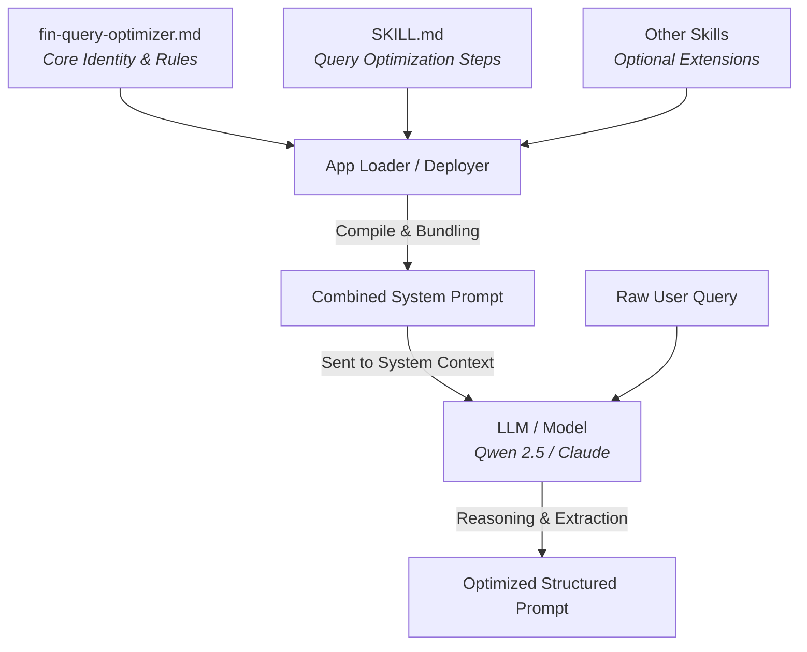

# 💡 How Models Use Skills & Generate Optimized Prompts

This document explains the architecture behind **FinQueryOptimizer's Skill-Based Prompt Enrichment Engine**, detailing how skills are dynamically bundled, how downstream LLMs consume them, and how optimized prompts are constructed.

---

## 🧭 The Skill Architecture Overview

In the Claude Agent and Ollama-based middleware patterns, **Skills** represent modular, domain-specific instruction sets. Rather than writing a single massive, monolithic system prompt, we separate the **Agent's Core Identity & Rules** from the **Executable Skills** it possesses.



---

## 🛠️ Step 1: Dynamic Skill Loading & Prompt Bundling

When the optimizer starts up (either locally via `app.py` or when deploying as a Claude Managed Agent), the prompt builder compiles the system instructions dynamically.

### How `app.py` Integrates Skills:
1. **Load Core Prompt**: It reads the agent instructions from `fin-query-optimizer.md` and strips the frontmatter configuration.
2. **Scan Skills Directory**: It walks the `./financial-services/plugins/agent-plugins/fin-query-optimizer/skills/` directory.
3. **Parse Skill Files**: For every subdirectory containing a `SKILL.md` or `skill.md` file, it:
   - Reads the file.
   - Strips the YAML frontmatter.
   - Appends it to the core system prompt under a `## Bundled Skills` section.

### Python Loading Logic in `app.py`:
```python
# Extract skill content, removing the frontmatter
skill_body = skill_data.split("---")[-1].strip()
skill_name = os.path.basename(os.path.dirname(skill_path))
skills_content.append(f"### Skill: {skill_name}\n{skill_body}")

if skills_content:
    system_prompt += "\n\n## Bundled Skills\n\n" + "\n\n".join(skills_content)
```

---

## 🧠 Step 2: How the Model Uses the Skills

Once the model receives the combined system prompt, it acts as an execution engine for the instructions and skills. It does not answer user queries directly; instead, it processes user queries by applying the step-by-step logic defined in the **Query Optimization Skill**:

| Execution Phase | What the Model Does | Instructions Derived From |
| :--- | :--- | :--- |
| **Phase 1: Intent & Domain Classification** | Determines if the input belongs to the financial or business domain. Checks if it contains sufficient context (entities, metrics, timeframes). | `Step 1: Classify Query Intent and Domain` in `SKILL.md` |
| **Phase 2: Ambiguity & Completeness Check** | Evaluates whether the query is too vague (e.g. *"What is mythos?"*) or incomplete. If ambiguous, resolves the ambiguity internally using reasonable fallback assumptions. | `Step 2: Handle Ambiguity` in `SKILL.md` |
| **Phase 3: Entity Enrichment** | Maps companies to their formal names/tickers, identifies sectors, determines temporal context, and maps appropriate financial metrics. | `Step 3: Extract and Enrich Entities` in `SKILL.md` |
| **Phase 4: Output Generation** | Produces the final output as clean Markdown, adhering strictly to the structured 5-part format without conversational filler. | `Step 4: Output Formatting` in `SKILL.md` & `fin-query-optimizer.md` |

---

## ⚡ Step 3: Generating the Optimized Prompt

The core output of the model is a **structured, enriched prompt** designed to guide a downstream RAG system or LLM to perform high-quality financial analysis.

### The 5 Core Elements of the Enriched Prompt:

1. **Role (System Persona)**
   - *Example:* `Act as a senior equity research analyst.`
   - *Why:* Personas guide the LLM's tone, depth of analysis, and professional terminology.
2. **Task (Analytical Objective)**
   - *Example:* `Compare the financial performance and leverage metrics of SBI and HDFC Bank.`
   - *Why:* Prevents generic summaries and directs the LLM to perform specific analysis.
3. **Context & Entities (Mapping & Boundaries)**
   - *Example:* `Companies: State Bank of India (SBI), HDFC Bank. Timeframe: Fiscal Years 2021 to 2024.`
   - *Why:* Restricts search boundaries to prevent hallucinations and temporal leakage.
4. **Metrics (Quantitative Variables)**
   - *Example:* `Net Interest Margin (NIM), Non-Performing Assets (NPA) ratio, Return on Assets (ROA), Capital Adequacy Ratio (CAR).`
   - *Why:* Directs the RAG system to retrieve the exact figures required for analysis.
5. **Output Format (Presentation Standard)**
   - *Example:* `Provide a comparative markdown table with the metrics, followed by a risk assessment of asset quality.`
   - *Why:* Ensures consistent, machine-readable, or publication-ready layouts.

---

## 🔄 Handling Ambiguous / Vague Queries

The model operates deterministically to always return only a structured 5-part refined prompt. If the input query is vague or ambiguous (e.g., *"What is SBI and RBI?"* or *"What is mythos?"*), the model makes reasonable fallback assumptions to enrich the query and outputs the structured refined prompt directly without any extra section headers or prompting the user.

### Example: Ambiguous Query Optimization
*   **Raw Input:** `"What is SBI and RBI?"`
*   **Output:**
    ```markdown
    1. Role: Act as a senior equity research analyst.
    2. Task: Provide detailed information on State Bank of India (SBI) and Reserve Bank of India (RBI).
    3. Context & Entities: SBI (Public sector bank), RBI (Central banking institution of India).
    4. Metrics: Include recent financial performance metrics such as revenue, profit, assets, liabilities, market capitalization, and any regulatory or policy roles.
    5. Output Format: Provide a structured comparative report with a balanced risk assessment for both entities.
    ```
